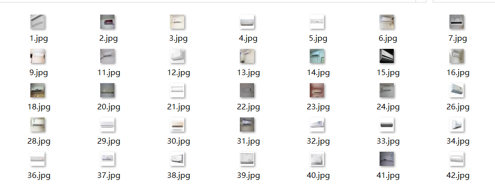
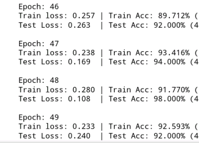
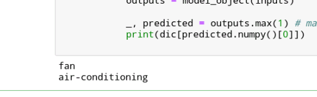
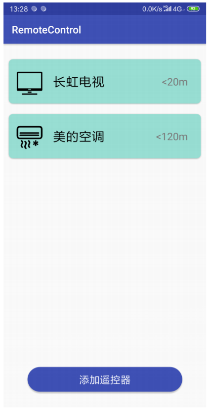
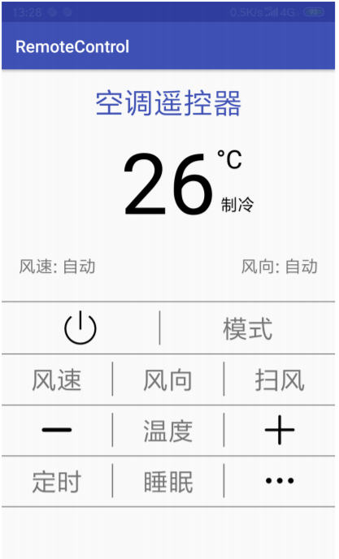
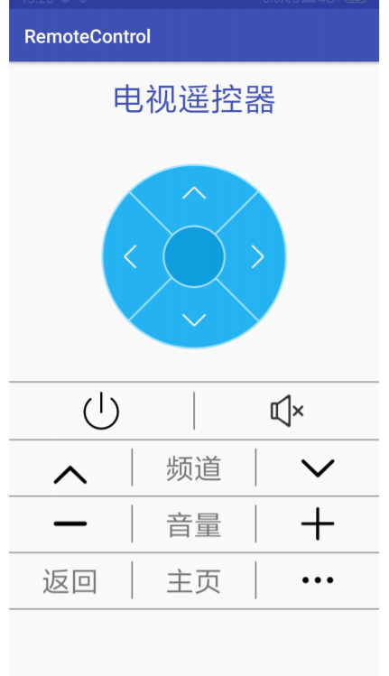
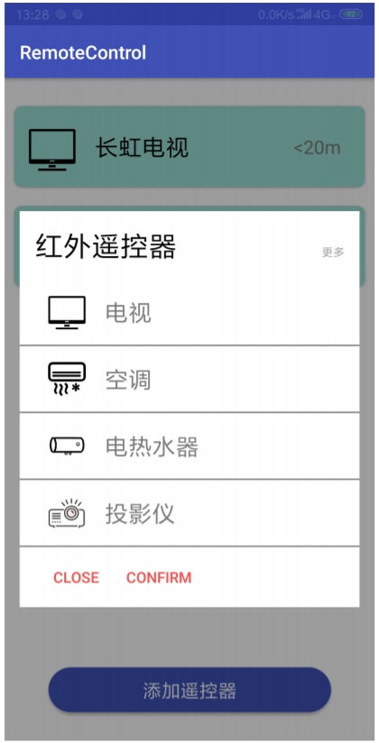
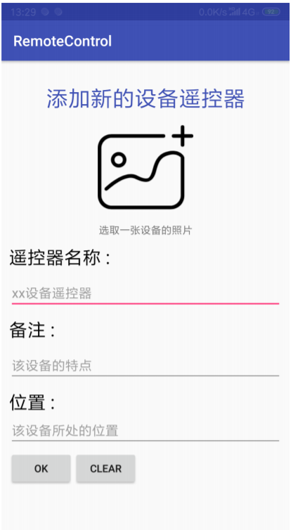
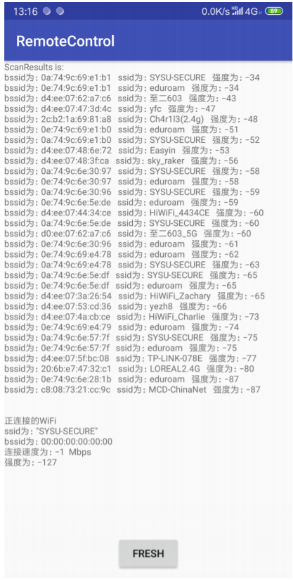

# 拍照遥控器项目报告

## 一.  项目简介

​	拍照遥控器是一款基于wifi指纹定位与图像识别技术来实现对于常用电子设备的遥控控制的Android客户端应用，面向日常苦于寻找各类遥控器的人群。该项目基于C-S架构，采用k-NN算法来进行wifi指纹比对，以确定用户所在室内的哪一个区域，再通过用户对于设备的拍照上传返回当前设备的具体信息，最后通过设备信息来获得遥控设备的红外参数进行控制。

## 二. 需求分析与功能设计

### 1. 需求

+ 由于GPS在室内信号弱，用户常常无法通过gps信号准确定位自己所处的室内具体位置，用户希望应用能告知当前的室内位置。
+ 现实生活中，由于多种电子设备在市场的涌现，对于这些各种各样电子设备都需要一个唯一的遥控器。这种情况导致用户希望能用一个遥控器代替各种遥控器来进行操纵，省去找遥控器的烦恼。
+ 在学校公共的会议室等场所，许多间房间共用一个遥控器，用户想要操纵电子设备必须到管理人员处拿遥控器，这样就导致使用的不方便。用户希望能通过手机简单的识别出当前的设备，并对其进行操纵。

### 2. 功能

基于上述的用户需求，故该应用具有以下的功能。

+ 对于用户所处的室内位置进行定位
+ 添加新的遥控器
+ 保存遥控器信息
+ 对于用户想要遥控的设备进行图像识别
+ 对于用户想要遥控的设备进行红外线控制

## 三. 模块组成

### 1. 图像识别神经网络模块

#### a. 获取数据集并处理图片

图片通过百度，谷歌等图片搜索引擎获取，利用多线程下载到本地，并重新按顺序进行命名。


通过py脚本处理图片，利用数据增广技术，为图片添加旋转移动缩放，添加噪音等操作扩充数据集。

处理完成后：



#### b. 定义神经网络结构

这里利用的是DenseNet来进行图像分类，

`ResNet模型`的核心是通过建立前面层与后面层之间的“短路连接”（shortcuts，skip connection），这有助于训练过程中梯度的反向传播，从而能训练出更深的CNN网络。

`DenseNet模型`的基本思路与ResNet一致，但是它建立的是前面所有层与后面层的密集连接（dense connection），它的名称也是由此而来。DenseNet的另一大特色是通过特征在channel上的连接来实现特征重用（feature reuse）。这些特点让DenseNet在参数和计算成本更少的情形下实现比ResNet更优的性能，DenseNet也因此斩获CVPR 2017的最佳论文奖。

```python
# Load necessary modules here
import math
import torch
import torch.nn as nn
import torch.nn.functional as F
import torch.optim as optim
import torch.backends.cudnn as cudnn
import os

class Bottleneck(nn.Module):
    '''
        the above mentioned bottleneck, including two conv layer, one's kernel size is 1?, another's is 3?

        after non-linear operation, concatenate the input to the output
    '''
    def __init__(self, in_planes, growth_rate):
        super(Bottleneck, self).__init__()
        self.bn1 = nn.BatchNorm2d(in_planes)
        self.conv1 = nn.Conv2d(in_planes, 4*growth_rate, kernel_size=1, bias=False)
        self.bn2 = nn.BatchNorm2d(4*growth_rate)
        self.conv2 = nn.Conv2d(4*growth_rate, growth_rate, kernel_size=3, padding=1, bias=False)

    def forward(self, x):
        out = self.conv1(F.relu(self.bn1(x)))
        out = self.conv2(F.relu(self.bn2(out)))
        
        # input and output are concatenated here
        out = torch.cat([out,x], 1)
        return out


class Transition(nn.Module):
    '''
        transition layer is used for down sampling the feature
        
        when compress rate is 0.5, out_planes is a half of in_planes
    '''
    def __init__(self, in_planes, out_planes):
        super(Transition, self).__init__()
        self.bn = nn.BatchNorm2d(in_planes)
        self.conv = nn.Conv2d(in_planes, out_planes, kernel_size=1, bias=False)

    def forward(self, x):
        
        out = self.conv(F.relu(self.bn(x)))
        # use average pooling change the size of feature map here
        out = F.avg_pool2d(out, 2)
        return out 

    
class DenseNet(nn.Module):
    def __init__(self, block, nblocks, growth_rate=12, reduction=0.5, num_classes=10):
        super(DenseNet, self).__init__()
        '''
        Args:
            block: bottleneck
            nblock: a list, the elements is number of bottleneck in each denseblock
            growth_rate: channel size of bottleneck's output
            reduction: 
        '''
        self.growth_rate = growth_rate

        num_planes = 2*growth_rate
        self.conv1 = nn.Conv2d(3, num_planes, kernel_size=3, padding=1, bias=False)
        
        # a DenseBlock and a transition layer
        self.dense1 = self._make_dense_layers(block, num_planes, nblocks[0])
        num_planes += nblocks[0]*growth_rate
        # the channel size is superposed, mutiply by reduction to cut it down here, the reduction is also known as compress rate
        out_planes = int(math.floor(num_planes*reduction))
        self.trans1 = Transition(num_planes, out_planes)
        num_planes = out_planes
        
        # a DenseBlock and a transition layer
        self.dense2 = self._make_dense_layers(block, num_planes, nblocks[1])
        num_planes += nblocks[1]*growth_rate
        # the channel size is superposed, mutiply by reduction to cut it down here, the reduction is also known as compress rate
        out_planes = int(math.floor(num_planes*reduction))
        self.trans2 = Transition(num_planes, out_planes)
        num_planes = out_planes

        # a DenseBlock and a transition layer
        self.dense3 = self._make_dense_layers(block, num_planes, nblocks[2])
        num_planes += nblocks[2]*growth_rate
        # the channel size is superposed, mutiply by reduction to cut it down here, the reduction is also known as compress rate
        out_planes = int(math.floor(num_planes*reduction))
        self.trans3 = Transition(num_planes, out_planes)
        num_planes = out_planes

        # only one DenseBlock 
        self.dense4 = self._make_dense_layers(block, num_planes, nblocks[3])
        num_planes += nblocks[3]*growth_rate

        # the last part is a linear layer as a classifier
        self.bn = nn.BatchNorm2d(num_planes)
        self.linear = nn.Linear(num_planes, num_classes)

    def _make_dense_layers(self, block, in_planes, nblock):
        layers = []
        
        # number of non-linear transformations in one DenseBlock depends on the parameter you set
        for i in range(nblock):
            layers.append(block(in_planes, self.growth_rate))
            in_planes += self.growth_rate
        return nn.Sequential(*layers)

    def forward(self, x):
        out = self.conv1(x)
        out = self.trans1(self.dense1(out))
        out = self.trans2(self.dense2(out))
        out = self.trans3(self.dense3(out))
        out = self.dense4(out)
        out = F.avg_pool2d(F.relu(self.bn(out)), 4)
        out = out.view(out.size(0), -1)
        out = self.linear(out)
        return out


def densenet():
    return DenseNet(Bottleneck, [2, 5, 4, 6])
```

这里定义的是17个Bottleneck的DenseNet，一共是39层（包括全连接层与卷积层）

#### c. 定义训练过程与测试过程

```python
import torchvision
import torchvision.transforms as transforms
from torch.autograd import Variable


def train(epoch, model, lossFunction, optimizer, device, trainloader):
    """train model using loss_fn and optimizer. When this function is called, model trains for one epoch.
    Args:
        train_loader: train data
        model: prediction model
        loss_fn: loss function to judge the distance between target and outputs
        optimizer: optimize the loss function
        get_grad: True, False
    output:
        total_loss: loss
        average_grad2: average grad for hidden 2 in this epoch
        average_grad3: average grad for hidden 3 in this epoch
    """
    print('\nEpoch: %d' % epoch)
    model.train()     # enter train mode
    train_loss = 0    # accumulate every batch loss in a epoch
    correct = 0       # count when model' prediction is correct i train set
    total = 0         # total number of prediction in train set
    for batch_idx, (inputs, targets) in enumerate(trainloader):
        inputs, targets = inputs.to(device), targets.to(device) # load data to gpu device
        inputs, targets = Variable(inputs), Variable(targets)
        optimizer.zero_grad()            # clear gradients of all optimized torch.Tensors'
        outputs = model(inputs)          # forward propagation return the value of softmax function
        loss = lossFunction(outputs, targets) #compute loss
        loss.backward()                  # compute gradient of loss over parameters 
        optimizer.step()                 # update parameters with gradient descent 

        train_loss += loss.item()        # accumulate every batch loss in a epoch
        _, predicted = outputs.max(1)    # make prediction according to the outputs
        total += targets.size(0)
        correct += predicted.eq(targets).sum().item() # count how many predictions is correct
        
        if (batch_idx+1) % 100 == 0:
            # print loss and acc
            print( 'Train loss: %.3f | Train Acc: %.3f%% (%d/%d)'
                % (train_loss/(batch_idx+1), 100.*correct/total, correct, total))
    print( 'Train loss: %.3f | Train Acc: %.3f%% (%d/%d)'
                % (train_loss/(batch_idx+1), 100.*correct/total, correct, total))
    
    
def test(model, lossFunction, optimizer, device, testloader):
    """
    test model's prediction performance on loader.  
    When thid function is called, model is evaluated.
    Args:
        loader: data for evaluation
        model: prediction model
        loss_fn: loss function to judge the distance between target and outputs
    output:
        total_loss
        accuracy
    """
    global best_acc
    model.eval() #enter test mode
    test_loss = 0 # accumulate every batch loss in a epoch
    correct = 0
    total = 0
    with torch.no_grad():
        for batch_idx, (inputs, targets) in enumerate(testloader):
            inputs, targets = inputs.to(device), targets.to(device)
            outputs = model(inputs)
            loss = lossFunction(outputs, targets) #compute loss

            test_loss += loss.item() # accumulate every batch loss in a epoch
            _, predicted = outputs.max(1) # make prediction according to the outputs
            total += targets.size(0)
            correct += predicted.eq(targets).sum().item() # count how many predictions is correct
        # print loss and acc
        print('Test Loss: %.3f  | Test Acc: %.3f%% (%d/%d)'
            % (test_loss/(batch_idx+1), 100.*correct/total, correct, total))
```

定义dataloader：加入transform来统一处理图片，正则化，切割边缘等操作

```python
def data_loader():
    # define method of preprocessing data for evaluating
    transform_train = transforms.Compose([
        transforms.Resize(32),
        transforms.RandomCrop(32, padding=4),
        transforms.RandomHorizontalFlip(),
        transforms.ToTensor(),
        # Normalize a tensor image with mean and standard variance
        transforms.Normalize((0.4914, 0.4822, 0.4465), (0.2023, 0.1994, 0.2010)),
    ])

    transform_test = transforms.Compose([
        transforms.Resize(32),
        transforms.ToTensor(),
        # Normalize a tensor image with mean and standard variance
        transforms.Normalize((0.4914, 0.4822, 0.4465), (0.2023, 0.1994, 0.2010)),
    ])
    
    # prepare dataset by ImageFolder, data should be classified by directory
    trainset = torchvision.datasets.ImageFolder(root='./household/train', transform=transform_train)

    testset = torchvision.datasets.ImageFolder(root='./household/test', transform=transform_test)

    # Data loader. 

    # Combines a dataset and a sampler, 

    trainloader = torch.utils.data.DataLoader(trainset, batch_size=64, shuffle=True)

    testloader = torch.utils.data.DataLoader(testset, batch_size=100, shuffle=False)
    return trainloader, testloader
```

### d. 训练网络

这里需要调整的参数包括

+ lossFunction 损失函数
+ lr 学习率
+ optimizer 优化器以及优化器中的参数，如weight_decay等
+ num_epochs 训练次数

```python
def run(model, num_epochs):
    
    # load model into GPU device
    device = 'cuda' if torch.cuda.is_available() else 'cpu'
    model.to(device)
    if device == 'cuda':
        model = torch.nn.DataParallel(model)
        cudnn.benchmark = True

    # define the loss function and optimizer

    lossFunction = nn.CrossEntropyLoss()
    lr = 0.01
    optimizer = optim.SGD(model.parameters(), lr=lr, momentum=0.9, weight_decay=5e-4)

    trainloader, testloader = data_loader()
    for epoch in range(num_epochs):
        train(epoch, model, lossFunction, optimizer, device, trainloader)
        test(model, lossFunction, optimizer, device, testloader)
        if (epoch + 1) % 50 == 0 :
            lr = lr / 10
            for param_group in optimizer.param_groups:
                param_group['lr'] = lr
```


### e. 训练结果



#### d. 保存模型并进行测试

定义保存路径，这里只保留网络的参数来节省开销。

```python
# save model
save_path = './model/classifier.pth'
torch.save(model.state_dict(), save_path)
```

运用训练好的模型进行测试

新传入两张图片来进行预测类别

```python
import torchvision
import torchvision.transforms as transforms
from torch.autograd import Variable
model_object = densenet()
model_object.load_state_dict(torch.load(save_path))
model_object.eval()

transform_test = transforms.Compose([
        transforms.Resize(32),
        transforms.ToTensor(),
        # Normalize a tensor image with mean and standard variance
        transforms.Normalize((0.4914, 0.4822, 0.4465), (0.2023, 0.1994, 0.2010)),
    ])

myset = torchvision.datasets.ImageFolder(root='./household/my', transform=transform_test)

myloader = torch.utils.data.DataLoader(myset, batch_size=1, shuffle=False)

dic = {0:'air-conditioning', 1:'fan', 2:'loudspeaker-box', 3:'projector', 4:'television'}
    
with torch.no_grad():
        for batch_idx, (inputs, targets) in enumerate(myloader):
            device = 'cuda' if torch.cuda.is_available() else 'cpu'
            inputs, targets = inputs, targets
            model_object
            outputs = model_object(inputs)
            
            _, predicted = outputs.max(1) # make prediction according to the outputs
            print(dic[predicted.numpy()[0]])

```

预测结果：



### 2. 客户端页面逻辑

具体页面代码不在这里展示，有需要的可以到github仓库中查询。

#### a.主页



#### b.空调遥控器页面



#### c.电视遥控器页面



#### d.添加遥控器页面



#### e. 添加详情页面



#### f. 获取wifi数据情况



### 3. 数据库模块

+ 为了方便数据的采集，我们设计了直接从安卓APP向服务器的数据库存储信息，通过 java 的 jdbc 连接数据库，实现了插入数据，查找数据，删除数据的功能。

+ 服务端也通过 jdbc 连接数据库，实现了数据库的查找功能，方便在服务端进行数据的计算。


### 4. 服务器模块

+ 接收来自客户端发送的数据信息和图片，将数据信息和图片路径记录在文件中，便于查找和纠错

  

+ 为客户端上传的图片生成随机命名，防止图片名重复的问题

  

### 5. wifi指纹定位模块

+ 数据采集部分，通过定点的数据采集，将采集到的数据汇总到数据库中
+ 数据处理部分，通过 IP 过滤的方法，只收集中大的 wifi 信息，避免其他信息的干扰


+ 指纹定位部分，将采集的 wifi 指纹数据同数据库中已有的数据进行匹配，匹配标准当mac地址相同，按照 wifi 强度的差距添加惩罚值，当mac地址多了或少了，加入一个固定的惩罚值，选取最终惩罚值最小的三条数据，通过其惩罚值进行加权平均，得到最终的预测位置。


### 6. 综合部分

+ 综合服务端的所有代码，java 写的 wifi 指纹定位，python 写的神经网络，解决java和python间的相互调用问题

  + java部分函数声明

  

  + java部分函数调用

  

  + c++部分实现

  

   	


## 四.技术难点与解决方案

+ 安卓APP模块：
  + 获取wifi数据要打开用户权限，在应用开始时添加询问的机制，否则无法正常获取wifi的数据。
  + 页面的显示使用了RecycleView + CardView的布局，使得页面列表更加友好，更加美观。
  + 关于wifi数据、图片的上传与网络对接，使用了Retrofit2.0来访问远端服务器的api，获取到的信息用到Gson工厂来解析。
+ 数据库模块：
  + 在连接云端的数据库时，要注意云服务器的端口是否打开，我使用的是阿里云，默认用于数据库连接的端口就没有打开，需要手动配置服务器的端口权限，才能连接到服务器。
+ 服务器模块：
  + 我使用的是javaEE，jsp，tomcet的方式配置服务器。环境的配置是一个难点，需要配置本地和服务器的环境，配置 javaEE 和 tomcet 的连接，尽量让本地和服务端的版本相同，否则可能会遇到很多玄学错误，例如本地可以运行，到服务端就出错的情况。同时也要注意 jdk 的版本问题。
  + 接收来自客户端的信息时，需要生成图片的存储路径和用于记录的文件路径，将客户端上传的图片生成随机的图片名，将图片存储到指定的文件夹中，并将路径记录在文件中。
+ wifi指纹定位模块：
  + 指纹的采集过程需要一定的过滤，以便于去掉一些强度很低的，不稳定的 wifi 信息，尽量采用固定的 wifi 信息用于 wifi 指纹定位。
  + wifi 指纹的加权平均，采用终惩罚的倒数进行加权，通过对数据库中已有 wifi 指纹的物理位置进行加权，最终得到加权后的定位作为 wifi 指纹的预测位置。
+ 神经网络模块：
  + 数据集收集量太少，导致网络训练效果不好。这一点是由数据引起的，最好的办法就是增大数据量，这里我利用到了数据增广的技术来将一张图片通过旋转偏移亮度变化等操作生成多张图片来扩充数据集。
  + 网络训练过程，注意超参数的设置，避免过拟合与缺拟合的情况出现。
+ 综合部分
  + 综合服务端的代码，难点是如何在 java 文件中调用 python 的函数。由于在 python 的编写过程中调用了第三方库，为 java 的调用增加了很大难度。我采用的方法是 java 调用 c++ ，在通过 c++ 调用 python。

## 五. 总结

通过这次的拍照遥控器项目，让我们掌握了 wifi 指纹定位的基本方法与实现，使用 pytorch 进行图片的分类等。在项目的进行过程中，我们也遇到了各种各样的问题，通过我们集体的努力下，问题不断克服，bug逐渐变少，最终基本完成了这次的项目。项目的实现过程从实现基本功能开始，再不断完善代码，使用更好的处理方法，让最终实现的效果越来越好。通过这次的项目，也让我们对android开发与后端功能实现有了更深入的了解，对二者的结合也更加熟练，例如不同后端语言的整合，客户端服务端的交互等。

总的来说，通过这次的项目，提升了我们的编程水平，思维水平，团队合作意识等，对我们有着很大的提高。

